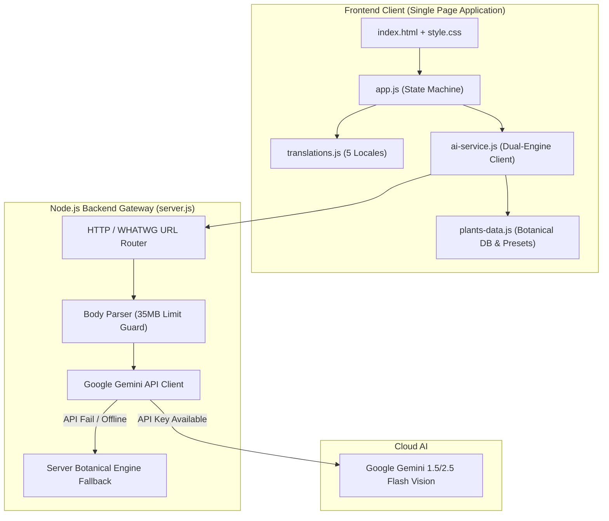

# 🌱 PlantCare AI (2026 Production Edition)

> *“Take a photo. Understand your plant. Care smarter.”*

**PlantCare AI** is an AI-powered botanical health and plant care assistant web application. It integrates computer vision diagnosis, personalized care plans, localized seasonal calendars, contextual chat assistance, and native 5-language localization.

---

## 📑 Table of Contents

1. [Key Features](#-key-features)
2. [Technical Architecture](#-technical-architecture)
3. [REST API Documentation](#-rest-api-documentation)
4. [Database & Data Schemas](#-database--data-schemas)
5. [Error Boundaries & Fault Tolerance](#-error-boundaries--fault-tolerance)
6. [Automated Unit Testing](#-automated-unit-testing)
7. [Installation & Getting Started](#-installation--getting-started)
8. [Directory Structure](#-directory-structure)

---

## ✨ Key Features

- **🌿 Nature-Inspired Modern Interface**: Lush emerald, mint, amber, and coral palette with glassmorphism cards and smooth micro-animations.
- **📸 Scan Your Plant & Vision Analysis**: Upload or capture plant/leaf photos with live preview, animated neural scanning screen, and instant sample cards.
- **🚫 Non-Plant Object Detection**: Automatically detects non-plant photos (e.g. cars, electronics, household objects) and alerts the user.
- **📊 Plant Health Report & Care Plan**: Categorizes health status (`✅ Healthy`, `⚠️ Needs Attention`, `❗ Unhealthy`), symptoms, disease, explanation, and tailored Care Plan (💧 Water, ☀️ Sun, 🌱 Soil, ✂️ Tips).
- **💬 Ask PlantCare AI (Context-Aware Chat)**: AI assistant grounded in the scanned plant's condition with suggested quick prompts.
- **🗓️ Enter Your Plant Name & Seasonal Guide**: Botanical search detailing planting seasons, best months, climate, and growing requirements.
- **🌐 5-Language Native Localization**: 100% of UI and AI responses support English (🇬🇧), Tamil (🇮🇳 தமிழ்), Hindi (🇮🇳 हिन्दी), Malayalam (🇮🇳 മലയാളം), and Kannada (🇮🇳 ಕನ್ನಡ).
- **⚡ Dual AI Architecture**: Google Gemini 2.5/1.5 Flash Vision integration + built-in offline botanical neural engine.

---

## 🏛️ Technical Architecture



---

## 📡 REST API Documentation

### 1. Health Check
`GET /api/health`

Returns application operational status and version.

- **Headers**: None required
- **Response (200 OK)**:
```json
{
  "status": "ok",
  "app": "PlantCare AI",
  "version": "1.0.0",
  "timestamp": "2026-10-07T17:45:00.000Z"
}
```

---

### 2. Plant Image Analysis
`POST /api/analyze-plant`

Analyzes plant imagery using Google Gemini Vision or the built-in botanical neural engine.

- **Headers**:
  - `Content-Type: application/json`
  - `x-gemini-key` *(Optional)*: Google Gemini API Key
- **Request Body**:
```json
{
  "imageData": "data:image/jpeg;base64,...",
  "lang": "ta"
}
```
- **Response (200 OK - Plant Detected)**:
```json
{
  "success": true,
  "data": {
    "isPlant": true,
    "plantName": "மான்ஸ்டெரா டெலிசியோசா",
    "botanicalName": "Monstera deliciosa",
    "status": "healthy",
    "confidence": 96,
    "symptoms": "அடர்ந்த பச்சை இலைகள், அழகான துளைகள்.",
    "disease": "எதுவுமில்லை (முழு ஆரோக்கியம்)",
    "explanation": "தாவரம் மிகச் சிறந்த ஒளிச்சேர்க்கை கொண்டுள்ளது.",
    "carePlan": {
      "wateringAdvice": "மேல் மண் காய்ந்ததும் தண்ணீர் ஊற்றவும்.",
      "sunlightAdvice": "மறைமுக பிரகாசமான சூரிய ஒளி.",
      "soilAdvice": "தேங்காய் நார் கலந்த காற்றோட்டமான மண்.",
      "careTips": "இலைகளில் உள்ள தூசியைத் துடைக்கவும்."
    }
  }
}
```
- **Response (200 OK - Non-Plant Object Detected)**:
```json
{
  "success": true,
  "data": {
    "isPlant": false,
    "message": "தாவரம் கண்டறியப்படவில்லை. தயவுசெய்து செடியின் தெளிவான புகைப்படத்தைப் பதிவேற்றவும்."
  }
}
```

---

### 3. Plant Information by Name
`POST /api/plant-info`

Provides seasonal planting guidance and environmental requirements for a given plant species.

- **Headers**:
  - `Content-Type: application/json`
  - `x-gemini-key` *(Optional)*: Google Gemini API Key
- **Request Body**:
```json
{
  "plantName": "Tomato",
  "lang": "hi"
}
```
- **Response (200 OK)**:
```json
{
  "success": true,
  "data": {
    "plantName": "टमाटर का पौधा",
    "botanicalName": "Solanum lycopersicum",
    "season": "खरीफ और रबी मौसम",
    "months": "जून-जुलाई एवं अक्टूबर-नवंबर",
    "climate": "गर्म एवं शीतोष्ण जलवायु, 21°C से 28°C",
    "sunlight": "पूर्ण धूप (प्रतिदिन 6-8 घंटे सीधी धूप)",
    "water": "जड़ों के पास नियमित रूप से पानी दें।",
    "growingTips": "पौधों को लकड़ी के सहारे सीधा खड़ा रखें।"
  }
}
```

---

### 4. Conversational Chat Assistant
`POST /api/chat`

Generates contextual responses to follow-up plant care questions in the selected language.

- **Headers**:
  - `Content-Type: application/json`
  - `x-gemini-key` *(Optional)*: Google Gemini API Key
- **Request Body**:
```json
{
  "message": "Why are leaves turning yellow?",
  "context": {
    "plantName": "Monstera Deliciosa",
    "status": "needs_attention"
  },
  "chatHistory": [],
  "lang": "en"
}
```
- **Response (200 OK)**:
```json
{
  "success": true,
  "data": {
    "reply": "Yellow leaves on your Monstera Deliciosa are most frequently caused by overwatering or poor drainage. Check soil moisture 2 inches down before watering."
  }
}
```

---

## 🗄️ Database & Data Schemas

### Botanical Species Profile (`BOTANICAL_DATABASE`)

```typescript
interface BotanicalProfile {
  botanicalName: string;
  names: Record<'en' | 'ta' | 'hi' | 'ml' | 'kn', string>;
  season: Record<'en' | 'ta' | 'hi' | 'ml' | 'kn', {
    season: string;
    months: string;
    climate: string;
    sunlight: string;
    water: string;
    growingTips: string;
  }>;
  care?: Record<string, Record<'en' | 'ta' | 'hi' | 'ml' | 'kn', {
    symptoms: string;
    disease: string;
    explanation: string;
    wateringAdvice: string;
    sunlightAdvice: string;
    soilAdvice: string;
    careTips: string;
  }>>;
}
```

---

## 🛡️ Error Boundaries & Fault Tolerance

| Layer | Error Boundary Mechanism | Fallback Action |
|---|---|---|
| **Client UI** | Safe DOM renderers & FileReader checks | Shows localized toast notifications, resets preview safely. |
| **Non-Plant Classifier** | Heuristic & vision classification | Renders friendly "Plant Not Detected" guidance view. |
| **Network Failure** | Dual-mode transport in `ai-service.js` | Transparently falls back to local botanical database. |
| **Stream Parser** | 35MB size limit & JSON parser try/catch | Destroys oversized sockets, returns `{}` on broken JSON without server crash. |
| **Gemini API** | HTTPS request timeout & quota failure trap | Gracefully serves offline botanical recommendations. |
| **Routing** | SPA Catch-All fallback in `server.js` | Serves `index.html` on unmapped paths with 200 OK. |

*For complete technical details, see [`docs/TESTING_AND_ERROR_BOUNDARIES.md`](docs/TESTING_AND_ERROR_BOUNDARIES.md).*

---

## 🧪 Automated Unit Testing

PlantCare AI includes an automated unit and integration testing suite covering dictionaries, botanical heuristics, API endpoints, and error boundaries.

### Run Tests
```bash
npm test
```

### Test Coverage Summary (24 / 24 Passing Tests)
- `tests/translations.test.js`: 100% key parity & Unicode validation for Tamil, Hindi, Malayalam, Kannada, and English.
- `tests/botanical-engine.test.js`: Validates presets, disease profiles, and client AI responses.
- `tests/api.test.js`: Validates all HTTP endpoints, CORS headers, and static asset delivery.
- `tests/error-boundary.test.js`: Validates malformed payload recovery, unknown locale fallback, and SPA routing.

---

## 🚀 Installation & Getting Started

### Prerequisites
- Node.js (v18+) or Antigravity Node (`agy-node`)

### Quickstart
```bash
# 1. Clone repository
git clone https://github.com/santhoshkumarg281-boop/plant-health-checking.git
cd plant-health-checking

# 2. Run server
npm start
# or: agy-node server.js
```

Open your browser at: **`http://localhost:3000`**

### Optional: Configure Gemini API Key
Create a `.env` file or click the ⚙️ settings icon in the top-right header:
```bash
PORT=3000
GEMINI_API_KEY="your-gemini-api-key"
```

---

## 📁 Directory Structure

```
plantcare-ai/
├── package.json               # Scripts (start, dev, test) & package metadata
├── server.js                  # Production HTTP server & Gemini API proxy
├── README.md                  # Comprehensive technical documentation
├── .env.example               # Environment variables template
├── .gitignore                 # Git ignore rules
├── docs/
│   └── TESTING_AND_ERROR_BOUNDARIES.md # Deep-dive testing & fault-tolerance guide
├── tests/
│   ├── translations.test.js   # Multilingual key parity & Unicode assertions
│   ├── botanical-engine.test.js # Botanical database & local AI unit tests
│   ├── api.test.js            # REST API integration tests
│   └── error-boundary.test.js # Fault tolerance & error boundary tests
└── public/
    ├── index.html             # Semantic HTML5 Single Page Application
    ├── css/
    │   └── style.css          # Nature-inspired glassmorphism styles & animations
    ├── js/
    │   ├── app.js             # Frontend controller & UI state machine
    │   ├── translations.js    # 100% native localization dictionaries
    │   ├── ai-service.js      # Client AI service handler (Gemini + Local)
    │   └── plants-data.js     # Botanical knowledge base & sample presets
    └── assets/
        ├── logo.svg           # Signature Plant 🌱 + AI 🤖 logo
        └── samples/           # Interactive sample SVGs (Monstera, Tomato, Rose, Snake, Car)
```
