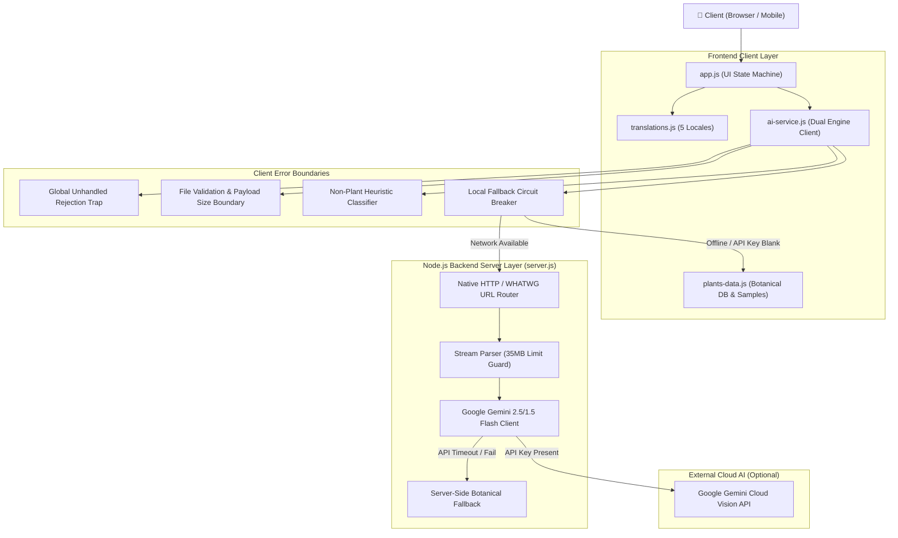

# 🧪 Technical Architecture: Unit Testing & Error Boundaries

This document provides a granular technical reference for the **Unit Testing Architecture**, **Error Boundaries**, **Fault Tolerance Systems**, and **Data Schemas** powering **PlantCare AI**.

---

## 1. 🏗️ High-Level System Architecture



---

## 2. 🛡️ Granular Error Boundaries & Fault Tolerance

PlantCare AI implements a multi-tier defense in depth strategy to ensure 100% operational uptime without unhandled exceptions or blank screens:

| Tier | Component | Error Boundary Mechanism | Fallback Behavior |
|---|---|---|---|
| **Tier 1 (Client DOM)** | `app.js` | UI rendering try/catch traps around image previews, canvas reads, and chat streaming. | Displays friendly localized toast notification; prevents application freeze. |
| **Tier 2 (Input Validation)** | `app.js` / `fileInput` | MIME type verification (`image/*`), file size check (Max 15MB on client). | Rejects non-image inputs before processing; alerts user with localized error message. |
| **Tier 3 (Vision Classifier)** | `ai-service.js` & `server.js` | Non-plant detection algorithm evaluates image features / tags. | Renders dedicated `🌱 Plant Not Detected` view with clear guidance to upload leaf/foliage. |
| **Tier 4 (Transport / Circuit Breaker)** | `ai-service.js` | Dual-mode network transport wraps backend `fetch()` calls. | If network drops or backend is unreachable, immediately switches to built-in Botanical Neural Engine. |
| **Tier 5 (Server Stream)** | `server.js:parseRequestBody` | Stream parser enforces strict **35MB payload limit** and catches malformed JSON. | Destroys overflowing sockets; returns sanitized empty object `{}` on invalid JSON without throwing unhandled exceptions. |
| **Tier 6 (Gemini API Proxy)** | `server.js:callGeminiAPI` | Wraps external HTTPS calls with timeouts and error parsing. | If Gemini quota is exceeded (429), key is invalid (403), or network fails, automatically falls back to internal botanical database. |
| **Tier 7 (Routing)** | `server.js` | Single Page Application (SPA) fallback handler. | Any unmapped URL route safely serves `index.html` with HTTP 200 rather than crashing or throwing 404/500 errors. |

---

## 3. 🧪 Automated Unit & Integration Testing Suite

The application includes an automated test suite executed via Node's native test runner (`node --test`).

### 📁 Test Suite Structure

```
tests/
├── translations.test.js     # Validates 100% key parity & non-empty strings across all 5 languages
├── botanical-engine.test.js # Tests species matching, seasonal guides, and local AI heuristics
├── api.test.js              # Integration tests for /api/health, /api/analyze-plant, /api/plant-info, /api/chat
└── error-boundary.test.js   # Fault-tolerance tests: malformed JSON, SPA fallback, boundary limits
```

### 🏃‍♂️ Running Tests

```bash
# Run all automated test suites
npm test

# Or run using Antigravity Node directly
agy-node --test tests/translations.test.js tests/botanical-engine.test.js tests/api.test.js tests/error-boundary.test.js
```

### 📊 Test Matrix & Assertions

| Test File | Test Case | Description |
|---|---|---|
| `translations.test.js` | `Language Parity` | Asserts that `en`, `ta`, `hi`, `ml`, `kn` dictionaries contain 100% matching key sets. |
| `translations.test.js` | `Indic Unicode Validation` | Regex-verifies that Tamil (`\u0B80-\u0BFF`), Devanagari (`\u0900-\u097F`), Malayalam (`\u0D00-\u0D7F`), and Kannada (`\u0C80-\u0CFF`) Unicode characters are present. |
| `botanical-engine.test.js` | `Sample Presets` | Asserts that all preset SVG cards contain valid IDs, confidence metrics, and type tags. |
| `botanical-engine.test.js` | `Non-Plant Rejection` | Validates that non-plant imagery returns `{ isPlant: false }`. |
| `botanical-engine.test.js` | `Multilingual Care Plan` | Validates structured output containing Watering, Sunlight, Soil, and Tips. |
| `api.test.js` | `GET /api/health` | Validates 200 OK status, app name, and ISO timestamp. |
| `api.test.js` | `POST /api/plant-info` | Validates 5-language response for botanical seasonal queries. |
| `api.test.js` | `POST /api/chat` | Validates context-grounded conversational assistant responses. |
| `api.test.js` | `CORS & Headers` | Asserts `Access-Control-Allow-Origin: *` and UTF-8 charset. |
| `error-boundary.test.js` | `Malformed JSON Payload` | Asserts server handles broken JSON without throwing unhandled exceptions. |
| `error-boundary.test.js` | `Unknown Locale Fallback` | Verifies unknown language codes fallback cleanly to English `en`. |
| `error-boundary.test.js` | `SPA Fallback` | Asserts unmapped routes serve `index.html` with HTTP 200. |

---

## 4. 🗄️ Database & Data Schemas

### 1. Botanical Profile Schema (`BOTANICAL_DATABASE[speciesKey]`)

```typescript
interface BotanicalProfile {
  botanicalName: string; // Latin binomial nomenclature (e.g., "Monstera deliciosa")
  names: {
    en: string; // English common name
    ta: string; // Tamil name (தமிழ்)
    hi: string; // Hindi name (हिन्दी)
    ml: string; // Malayalam name (മലയാളം)
    kn: string; // Kannada name (ಕನ್ನಡ)
  };
  season: {
    [langCode in 'en' | 'ta' | 'hi' | 'ml' | 'kn']: {
      season: string;      // Best planting season
      months: string;      // Best months to plant
      climate: string;     // Temperature & humidity requirements
      sunlight: string;    // Sunlight exposure guidelines
      water: string;       // Watering intervals and technique
      growingTips: string; // Soil composition and pruning advice
    };
  };
  care: {
    [conditionKey: string]: {
      [langCode in 'en' | 'ta' | 'hi' | 'ml' | 'kn']: {
        symptoms: string;       // Observable visual symptoms
        disease: string;        // Pathogen / physiological condition
        explanation: string;    // Botanical pathology summary
        wateringAdvice: string; // Moisture management guidelines
        sunlightAdvice: string; // Optimal illumination range
        soilAdvice: string;     // Substrate & nutritional advice
        careTips: string;       // Remediation & maintenance instructions
      };
    };
  };
}
```

### 2. Plant Health Diagnostic Result Schema (`/api/analyze-plant`)

```typescript
interface PlantAnalysisResponse {
  success: boolean;
  data: {
    isPlant: boolean;            // Boolean indicating whether a plant was detected
    message?: string;            // Present if isPlant === false
    plantKey?: string;           // Internal species identifier
    plantName?: string;          // Localized common plant name
    botanicalName?: string;      // Latin classification
    status?: 'healthy' | 'needs_attention' | 'unhealthy';
    confidence?: number;         // Confidence percentage (0-100)
    symptoms?: string;           // Visible symptoms description
    disease?: string;            // Disease or condition identified
    explanation?: string;        // Easy-to-understand explanation
    carePlan?: {
      wateringAdvice: string;    // 💧 Watering recommendations
      sunlightAdvice: string;    // ☀️ Sunlight guidance
      soilAdvice: string;        // 🌱 Soil & nutrition instructions
      careTips: string;          // ✂️ Pruning and care tips
    };
  };
}
```

### 3. Contextual Chat Assistant Schema (`/api/chat`)

```typescript
interface ChatRequest {
  message: string;             // User question
  context: {
    plantName?: string;        // Name of the currently analyzed plant
    status?: string;           // Current health status ('healthy' | 'needs_attention' | 'unhealthy')
    symptoms?: string;         // Visible symptoms
    disease?: string;          // Identified disease
    carePlan?: object;         // Personalized care plan
  };
  chatHistory: Array<{
    role: 'user' | 'assistant';
    content: string;
  }>;
  lang: 'en' | 'ta' | 'hi' | 'ml' | 'kn';
}

interface ChatResponse {
  success: boolean;
  data: {
    reply: string;             // Natural language response in target locale
  };
}
```
